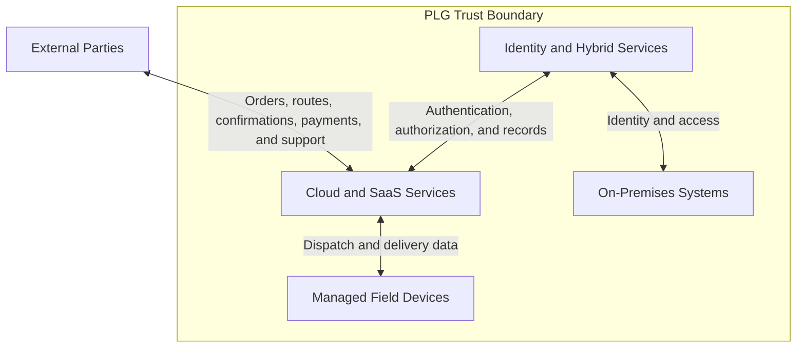

# Peachtree Logistics Group Security Risk & IAM Program

> A human-centered GRC portfolio case study for a fictional regional logistics company operating across cloud, on-premises, warehouse, mobile, and third-party environments.

## Project Overview

Peachtree Logistics Group (PLG) is a fictional Atlanta-based logistics company with approximately 225 employees. PLG provides warehousing, last-mile delivery, medical-courier services, and freight brokerage throughout the Southeastern United States.

This project evaluates PLG's company-wide security risks with a primary focus on identity and access management. It demonstrates how a GRC practitioner can translate business operations, data flows, technology dependencies, workforce behavior, and third-party relationships into practical security controls and measurable risk reduction.

The program is designed around one central principle:

> **Security controls must reduce risk without preventing employees, warehouse teams, dispatchers, drivers, and couriers from completing safe, time-sensitive work.**

## Business Problem

PLG operates a mixed cloud and on-premises environment but lacks consistent IAM governance across its workforce, applications, facilities, devices, and third-party relationships.

The organization faces increased risk from:

- Compromised Microsoft 365 and cloud accounts
- Excessive, conflicting, or outdated permissions
- Incomplete employee, contractor, courier, and vendor offboarding
- Shared or weakly governed operational accounts
- Mobile-device and BYOD exposure
- Medical-delivery information handled across multiple workflow stages
- Payment fraud and executive impersonation
- On-premises Warehouse Management System disruption
- Vendor-hosted services and external support access
- Security controls that may conflict with real operational workflows

A single compromised or improperly retained identity could expose customer, employee, payment, delivery, or medical-delivery information and interrupt essential logistics services.

## Project Goals

The project was created to:

1. Identify and assess risks across PLG's people, processes, technology, physical locations, and third parties.
2. Document systems, information assets, external entities, data flows, and trust boundaries.
3. Evaluate IAM practices across cloud and on-premises systems.
4. Design a role-based access control model using least privilege and segregation of duties.
5. Establish consistent provisioning, transfer, access-review, and offboarding procedures.
6. Protect mobile and medical-delivery workflows without introducing unsafe or impractical controls.
7. Develop role-specific security awareness and incident-response materials.
8. Define evidence requirements and repeatable control tests.
9. Establish KPIs and KRIs for measuring control performance and changes in organizational risk.
10. Analyze human factors that influence whether controls succeed in practice.

## Organization Profile

| Attribute | Description |
|---|---|
| Organization | Peachtree Logistics Group |
| Industry | Logistics, warehousing, last-mile delivery, medical courier, and freight brokerage |
| Headquarters | Atlanta, Georgia |
| Workforce | Approximately 225 employees, plus independent couriers and third parties |
| Geographic Area | Southeastern United States |
| Environment | Mixed cloud and on-premises systems |
| Primary Cloud Platform | Microsoft 365 and logistics SaaS applications |
| Primary On-Premises Platform | Warehouse Management System |
| Mobile Environment | PLG-issued and approved personal devices |
| Sensitive Information | Employee records, customer data, delivery records, payment information, contracts, vendor records, and applicable medical-delivery information |
| Primary Security Focus | Identity and access management, operational resilience, and human-centered control design |

## Technology and Trust Environment



The detailed Level 0 and Level 1 data-flow diagrams are available in [`docs/03-data-flow-diagrams.md`](docs/03-data-flow-diagrams.md).

## Assessment Approach

The project follows a practical GRC lifecycle:


### 1. Establish Context

- Define business objectives, scope, assumptions, and constraints.
- Identify stakeholders and decision authority.
- Document operational workflows and trust boundaries.

### 2. Identify Assets and Risks

- Inventory systems, devices, information, facilities, and third parties.
- Evaluate threats, vulnerabilities, likelihood, and business impact.
- Prioritize risks using a documented methodology.

### 3. Design Controls

- Map risks to preventive, detective, and corrective controls.
- Create RBAC roles and IAM lifecycle procedures.
- Address mobile, vendor, payment, medical-delivery, physical, and human factors.

### 4. Test and Measure

- Define evidence requirements and sampling methods.
- Test design and operating effectiveness.
- Establish KPIs, KRIs, thresholds, ownership, and escalation rules.

### 5. Improve and Report

- Track findings, root causes, remediation, and residual risk.
- Validate controls with frontline personnel.
- Present leadership with prioritized decisions and a 90-day roadmap.

## Key Risk Themes

| Risk Theme | Business Impact | Primary Response |
|---|---|---|
| Identity lifecycle gaps | Orphaned, excessive, or conflicting access | Joiner-mover-leaver workflow, RBAC, access reviews, and named ownership |
| Account compromise | Email, file, customer, and operational data exposure | MFA, conditional access, monitoring, phishing resistance, and session revocation |
| Privileged access | Broad unauthorized changes or system compromise | Separate admin accounts, least privilege, MFA, logging, and recurring review |
| Driver and courier devices | Exposure of routes, recipient details, signatures, photos, or medical-delivery information | Device requirements, assignment-limited access, minimal local data, and rapid session revocation |
| Medical-delivery information | Privacy, contractual, regulatory, and client-trust consequences | Minimum-necessary access, approved channels, recipient verification, and retention controls |
| Payment fraud | Direct financial loss and manipulated vendor or customer records | Independent verification, segregation of duties, strong authentication, and monitoring |
| WMS disruption or ransomware | Warehouse, inventory, staging, and fulfillment interruption | Patching, segmentation, endpoint protection, backups, recovery tests, and continuity procedures |
| Vendor dependency | Data exposure, outages, excessive support access, or delayed notification | Vendor tiering, contractual requirements, restricted access, monitoring, and offboarding |
| Human factors | Shared credentials, unsafe prompts, workarounds, delayed reporting, and alert fatigue | Frontline testing, role-based training, supportive reporting, and workflow redesign |

## Core Recommendations

### Identity and Access Management

- Establish authoritative workforce, contractor, courier, vendor, privileged, and service-account inventories.
- Implement standardized joiner-mover-leaver procedures.
- Use role-based access profiles and least privilege.
- Require recurring access reviews and documented remediation.
- Separate normal and privileged administrator accounts.
- Eliminate unnecessary shared accounts.
- Use named, MFA-protected, time-limited vendor access.

### Authentication and Microsoft 365

- Require MFA for all appropriate accounts and 100% of high-risk identities.
- Apply conditional access and contextual authentication.
- Monitor risky sign-ins, forwarding rules, application consent, mass downloads, and external sharing.
- Maintain controlled emergency-access accounts.

### Mobile and Delivery Workflows

- Separate PLG driver and independent-courier identities.
- Limit access by current assignment, role, time, and business need.
- Minimize local storage, screenshots, downloads, and sensitive notifications.
- Provide rapid lost-device reporting and session revocation.
- Design authentication and reporting for parked use only.

### Sensitive Information

- Classify information as Public, Internal, Confidential, or Restricted.
- Apply minimum-necessary access to medical-delivery information.
- Use approved storage and communication channels.
- Verify recipients before disclosure or delivery.
- Implement defined retention and secure-disposal rules.

### Operations and Resilience

- Protect the on-premises WMS through patching, segmentation, endpoint protection, and monitoring.
- Maintain protected, tested backups.
- Document secure manual workarounds for critical outages.
- Reconcile operational and financial records before normal processing resumes.

### People and Governance

- Provide role-specific training instead of relying only on generic annual awareness.
- Encourage early reporting of mistakes, suspicious activity, lost devices, and control conflicts.
- Distinguish slips, knowledge gaps, workarounds, reckless behavior, and malicious activity.
- Test controls with real users before broad implementation.
- Measure control effectiveness and operational friction together.

## 90-Day Roadmap

| Period | Objective | Priority Activities |
|---|---|---|
| Days 0–30 | Stabilize high-risk access | Assign owners; inventory identities; validate high-risk MFA; disable orphaned accounts; establish offboarding, payment verification, incident reporting, and driver-safety rules |
| Days 31–60 | Implement repeatable controls | Pilot RBAC; implement lifecycle workflows; begin access reviews; separate privileged and courier access; review Microsoft 365 controls; establish continuity methods; deliver role-based training |
| Days 61–90 | Validate and measure | Test controls; conduct incident exercises; validate backup restoration; establish KPI/KRI baselines; publish an executive dashboard; track remediation and frontline feedback |

## Project Deliverables

| # | Deliverable | Purpose |
|---:|---|---|
| 01 | [Project Charter](docs/01-project-charter.md) | Defines the business context, objectives, scope, assumptions, constraints, approach, and success criteria |
| 02 | [Stakeholder Analysis](docs/02-stakeholder-analysis.md) | Maps decision authority, operational influence, responsibilities, concerns, and engagement methods |
| 03 | [Data Flow Diagrams](docs/03-data-flow-diagrams.md) | Documents workflows, external entities, data stores, processes, data movement, and trust boundaries |
| 04 | [Asset and System Inventory](docs/04-asset-and-system-inventory.md) | Inventories information, applications, devices, infrastructure, facilities, and third-party dependencies |
| 05 | [Risk Assessment Methodology](docs/05-risk-assessment-methodology.md) | Defines likelihood, impact, inherent risk, residual risk, treatment, and reassessment rules |
| 06 | [Risk Register](docs/06-risk-register.md) | Records prioritized risks, affected assets, causes, consequences, controls, owners, and treatment plans |
| 07 | [Security Control Matrix](docs/07-security-control-matrix.md) | Maps risks to proposed control objectives, owners, evidence, implementation priorities, and framework references |
| 08 | [Role-Based Access Control Model](docs/08-role-based-access-control-model.md) | Defines roles, permissions, access boundaries, segregation of duties, approval, and review requirements |
| 09 | [IAM and Security Procedures](docs/09-iam-and-security-procedures.md) | Establishes provisioning, authentication, transfer, access review, offboarding, vendor, and exception procedures |
| 10 | [Security Awareness Plan](docs/10-security-awareness-plan.md) | Provides role-based training, scenarios, exercises, reporting expectations, and awareness metrics |
| 11 | [Incident Response Scenarios](docs/11-incident-response-scenarios.md) | Defines practical playbooks for account compromise, lost devices, sensitive-data exposure, fraud, ransomware, vendor incidents, and access failures |
| 12 | [Evidence and Control Testing Plan](docs/12-evidence-and-control-testing-plan.md) | Defines evidence standards, sampling, control tests, exception evaluation, findings, and remediation validation |
| 13 | [KPIs and KRIs](docs/13-kpis-and-kris.md) | Establishes performance and risk metrics, thresholds, data ownership, reporting cadence, and escalation rules |
| 14 | [Human Factors Analysis](docs/14-human-factors-analysis.md) | Evaluates workload, time pressure, interface design, safety, reporting culture, and control friction |
| 15 | [Executive Summary](docs/15-executive-summary.md) | Distills material risks, recommendations, leadership decisions, roadmap, benefits, and residual risk |

## Example Success Measures

| Measure | Proposed Initial Target |
|---|---:|
| MFA coverage | At least 98% overall; 100% for high-risk accounts |
| Timely offboarding | At least 98% overall; 100% for high-risk separations |
| Access review completion | 100% |
| Managed and compliant device coverage | At least 95%; 100% for privileged and Restricted-data access |
| Critical vulnerability remediation within target | At least 95% |
| Required training completed before sensitive access | 100% |
| Material incident milestones achieved within target | At least 95% |
| Critical restore tests completed successfully | 100% |
| Critical vendor reviews completed on time | 100% |
| Orphaned privileged accounts | 0 |
| Credible control-related driver safety conflicts | 0 |

The proposed targets are starting points. PLG would need valid baseline data before reporting actual performance.

## Framework and Practice Alignment

This portfolio demonstrates concepts associated with:

- NIST Cybersecurity Framework 2.0
- NIST SP 800-53 Rev. 5
- Identity and access management
- Role-based access control
- Least privilege
- Segregation of duties
- Joiner-mover-leaver governance
- Security risk assessment
- Third-party risk management
- Security awareness and behavior
- Incident response and recovery
- Evidence collection and control testing
- KPI and KRI design
- Human-centered security

Framework references are illustrative mappings. They do not establish certification or compliance.

HIPAA, PCI DSS, privacy, breach-notification, and contractual applicability would require validation based on PLG's actual role, data handling, payment architecture, jurisdictions, and agreements.

## Skills Demonstrated

### Governance, Risk, and Compliance

- Project scoping and charter development
- Stakeholder identification and engagement planning
- Asset and data classification
- Risk identification, analysis, scoring, treatment, and ownership
- Security-control design and mapping
- Policy and procedure development
- Third-party risk analysis
- Executive reporting and remediation planning

### Identity and Access Management

- RBAC design
- Least-privilege analysis
- Segregation-of-duties evaluation
- Joiner-mover-leaver procedures
- Privileged and service-account governance
- MFA and conditional-access strategy
- Vendor, contractor, driver, and courier identity separation
- Access certification and exception management

### Assurance and Measurement

- Evidence standards and evidence-register design
- Population validation and risk-based sampling
- Design and operating-effectiveness testing
- Finding development and root-cause analysis
- Remediation validation
- KPI, KRI, threshold, and dashboard design
- Residual-risk monitoring

### Operational and Human-Centered Security

- Business-process and data-flow analysis
- Trust-boundary modeling
- Mobile and field-work security
- Medical-delivery information handling
- Incident scenario and tabletop design
- Human factors and workflow-friction analysis
- Translation of security requirements into practical operational controls

## Repository Structure

```text
.
├── README.md
└── docs/
    ├── 01-project-charter.md
    ├── 02-stakeholder-analysis.md
    ├── 03-data-flow-diagrams.md
    ├── 04-asset-and-system-inventory.md
    ├── 05-risk-assessment-methodology.md
    ├── 06-risk-register.md
    ├── 07-security-control-matrix.md
    ├── 08-role-based-access-control-model.md
    ├── 09-iam-and-security-procedures.md
    ├── 10-security-awareness-plan.md
    ├── 11-incident-response-scenarios.md
    ├── 12-evidence-and-control-testing-plan.md
    ├── 13-kpis-and-kris.md
    ├── 14-human-factors-analysis.md
    └── 15-executive-summary.md
```

## How to Review This Project

For a concise leadership view, begin with the [Executive Summary](docs/15-executive-summary.md).

For the full assessment sequence, review the documents in numerical order. The progression moves from business context and system understanding through risk analysis, control design, implementation procedures, testing, measurement, and executive reporting.

Recommended paths:

- **Recruiters and hiring managers:** README → Executive Summary → Risk Register → Control Matrix → RBAC Model → Human Factors Analysis
- **GRC reviewers:** Charter → Methodology → Risk Register → Control Matrix → Testing Plan → KPIs and KRIs
- **IAM reviewers:** Data Flows → Asset Inventory → RBAC Model → IAM Procedures → Control Testing Plan
- **Operations reviewers:** Stakeholder Analysis → Data Flows → Incident Scenarios → Awareness Plan → Human Factors Analysis

## Project Perspective

This case study reflects my transition from logistics and operations into Governance, Risk, and Compliance. My operations background shaped the project's central question:

> How do we build controls that protect the organization while still working for the people responsible for warehouse operations, dispatch, delivery, customer service, medical-courier work, and financial processing?

The result is a portfolio project that treats cybersecurity as a coordinated system of people, processes, technology, accountability, evidence, and continuous improvement.

## Author

**Tommy Marshall**  
GRC and Cloud Security Practitioner in Transition  
Atlanta, Georgia

- LinkedIn: `[Add LinkedIn URL]`
- Portfolio: `[Add portfolio URL]`
- GitHub: `[Add GitHub profile URL]`

## Portfolio Disclaimer

Peachtree Logistics Group is a fictional organization created for educational and portfolio purposes. The systems, risks, findings, controls, metrics, targets, and recommendations in this repository are proposed examples rather than observations from a real organization.

This project does not represent an audit opinion, certification, penetration test, legal conclusion, regulatory determination, or claim that any organization complies with NIST, HIPAA, PCI DSS, or another framework or requirement.
