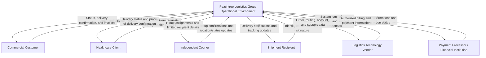

# Data-Flow Analysis

## Purpose

This document illustrates how customer, shipment, medical-delivery, identity, and payment information moves through Peachtree Logistics Group's operating environment. It combines business processes, supporting systems, external entities, and trust boundaries to support security-risk identification.

This is a logical data-flow and system-flow model. It is not a detailed network architecture diagram.

## Business Data Lifecycle

| Workflow Stage | Business Activity | People Involved | System or Device | Information Used | Destination |
|---|---|---|---|---|---|
| Customer order intake | A customer submits a warehousing, freight, last-mile, or medical-delivery request | Customer service representative; client contact | Email, customer portal, Microsoft 365, or logistics platform | Customer contacts, pickup and delivery addresses, shipment information, and potentially sensitive medical-delivery details | Cloud logistics platform and authorized operations personnel |
| Order review and scheduling | Operations staff validate order details, confirm requirements, and schedule fulfillment | Operations coordinator; warehouse operations manager | Logistics/freight platform; warehouse management system | Order details, service-level requirements, scheduling windows, and client account information | Warehouse management system and dispatch queue |
| Dispatch and driver assignment | Dispatch assigns the order to an available driver or courier based on route, capacity, and delivery window | Dispatch manager; drivers and couriers | Dispatch software; delivery application; mobile device | Route and stop details, delivery windows, addresses, limited recipient information, and applicable medical-delivery flags | PLG-employed driver or independent-courier delivery application |
| Pickup and transportation | The driver retrieves and transports the shipment using the assigned route and handling requirements | PLG-employed drivers; independent couriers | Delivery application; managed or approved mobile device | Pickup confirmation, status updates, delivery instructions, and applicable chain-of-custody notes | Dispatch and delivery platform |
| Delivery confirmation | The driver completes delivery and records proof of receipt | Driver or courier; shipment recipient | Mobile device; delivery application | Signature, photo where authorized, timestamp, recipient confirmation, and delivery exceptions | Dispatch and delivery platform and customer-facing order record |
| Billing, reporting, and retention | Completed delivery information supports invoicing, reporting, and policy-based retention | Billing staff; operations management; compliance personnel | Logistics platform; Microsoft 365; billing system; archive | Completed order and delivery records, customer billing information, and only the medical-delivery information necessary for an authorized purpose | Billing system, records archive, customer reporting, and management reporting |

## External-Entity Analysis

| External Entity | Data Sent to PLG | Data Received from PLG | Primary Security Concern |
|---|---|---|---|
| Commercial customer | Order details, addresses, contacts, and shipment requirements | Status updates, delivery confirmation, and invoices | Unauthorized disclosure or alteration of customer and shipment information |
| Healthcare client | Medical-delivery requirements, locations, delivery windows, and applicable PHI/ePHI | Delivery status, proof of delivery, and invoices | Unauthorized disclosure or inappropriate handling of PHI/ePHI |
| Independent courier | Availability, status updates, pickup and delivery confirmations, and proof-of-delivery information | Limited route, recipient, address, delivery-window, and handling information | Excessive access, unmanaged devices, insecure local storage, or access remaining active after the engagement |
| Shipment recipient | Identity confirmation, signature, or acknowledgment | Delivery notifications, tracking information, or arrival windows | Exposing shipment details to an unauthorized person or confirming the wrong recipient |
| Logistics technology vendor | System logs, alerts, updates, and support responses | Order, routing, account, and support information | Vendor breach, mishandling, excessive support access, or platform misconfiguration |
| Payment processor or financial institution | Payment confirmation and transaction status | Authorized billing and payment information | Exposure or interception of financial or payment information |

## Level 0: Context Diagram

### Level 0 Observations

- Medical-delivery information may cross several external boundaries and requires verification of where PHI/ePHI is actually collected, stored, transmitted, and retained.
- Independent couriers are external parties using less-trusted endpoints; their access should be limited by assignment, duration, and business need.
- PLG depends on technology vendors to process operational information, making vendor assurance, contractual requirements, access monitoring, and incident notification important.
- Payment flows should minimize PLG's exposure to cardholder data. PCI DSS applicability depends on whether PLG stores, processes, or transmits cardholder data.

## Level 1: Internal Processes, Systems, and Trust Boundaries

```mermaid
flowchart TB
    subgraph External["External Zone"]
        Customer["Commercial Customer"]
        Healthcare["Healthcare Client"]
        Recipient["Shipment Recipient"]
        Vendor["Logistics Technology Vendor"]
        Processor["Payment Processor / Financial Institution"]
        Courier["Independent Courier<br/>(Device)"]
    end

    subgraph PLG["Peachtree Logistics Group — Trust Boundary"]
        subgraph BusinessProcesses["Internal Business Processes"]
            P1["P1: Receive Customer Order"]
            P2["P2: Review and Schedule Order"]
            P3["P3: Assign Driver and Dispatch"]
            P4["P4: Perform Pickup and Delivery"]
            P5["P5: Confirm Delivery"]
            P6["P6: Process Billing and Retain Records"]
        end

        subgraph CloudZone["PLG Cloud / SaaS Zone"]
            D1[("D1: Microsoft 365")]
            D2[("D2: Logistics and Freight Platform")]
            D4[("D4: Dispatch and Delivery Platform")]
            D5[("D5: Billing and Accounting System")]
        end

        subgraph OnPremZone["PLG On-Premises Zone"]
            D3[("D3: Warehouse Management System")]
        end

        subgraph HybridZone["PLG Hybrid Services Zone"]
            IAM[("IAM: Identity and Access<br/>Management Service")]
            D6[("D6: Records Archive")]
        end

        subgraph FieldZone["PLG-Managed Mobile / Field Zone"]
            Driver["PLG-Employed Driver<br/>(Device)"]
        end
    end

    Customer -->|"Portal or phone order details"| P1
    Customer -->|"Order via email"| D1
    Healthcare -->|"Medical-delivery request and applicable PHI/ePHI"| P1
    D1 -->|"Forwarded order correspondence"| P1
    P1 -->|"Order record created"| D2

    D2 -->|"New order and service requirements"| P2
    P2 -->|"Validated schedule and order status"| D2
    P2 -->|"Fulfillment and staging request"| D3
    D3 -->|"Inventory and staging availability"| P2

    D2 -->|"Scheduled order and delivery requirements"| P3
    D3 -->|"Shipment readiness status"| P3
    D1 -->|"Dispatch exceptions and communications"| P3
    P3 -->|"Operational updates and exceptions"| D1
    P3 -->|"Driver assignment, route, and delivery window"| D4
    D4 -->|"Route and limited recipient information"| Driver
    D4 -->|"Route and limited recipient information"| Courier

    Driver -->|"Pickup confirmation and status updates"| P4
    Courier -->|"Pickup confirmation and status updates"| P4
    P4 -->|"Pickup, location, and shipment status"| D4
    P4 -->|"Delivery outcome and proof details"| P5
    Recipient -->|"Identity confirmation and signature"| P5
    P5 -->|"Proof of delivery and exceptions"| D4
    P5 -->|"Completed delivery status"| D2
    D4 -->|"Delivery notification and tracking update"| Recipient
    D4 -->|"Delivery status and confirmation"| Customer
    D4 -->|"Delivery status and confirmation"| Healthcare

    D2 -->|"Completed order and customer billing data"| P6
    D4 -->|"Delivery record and proof of delivery"| P6
    P6 -->|"Invoice and accounting record"| D5
    P6 -->|"Approved retention record"| D6
    P6 -->|"Management and compliance reports"| D1
    P6 -->|"Authorized billing and payment information"| Processor
    Processor -->|"Payment confirmation and transaction status"| P6
    D5 -->|"Invoice"| Customer
    D5 -->|"Invoice"| Healthcare

    Vendor -->|"Logs, alerts, updates, and support responses"| D2
    Vendor -->|"Logs, alerts, updates, and support responses"| D4
    D2 -->|"Authorized platform and support data"| Vendor
    D4 -->|"Authorized platform and support data"| Vendor

    IAM -.->|"Authentication and authorization"| D1
    IAM -.->|"Authentication and authorization"| D2
    IAM -.->|"Authentication and authorization"| D3
    IAM -.->|"Authentication and authorization"| D4
    IAM -.->|"Authentication and authorization"| D5
    IAM -.->|"Authentication and authorization"| D6
```

### Diagram Conventions

- Solid arrows represent business or operational information flows.
- Dotted arrows represent authentication and authorization relationships.
- Cylinders represent systems or logical data stores.
- A boundary identifies a different level of organizational control or trust; it does not by itself prove that the environment is secure.

### Level 1 Observations

- Email creates an alternate intake path outside the primary logistics platform and may lead to duplicate or uncontrolled copies of sensitive information.
- Information crosses cloud, on-premises, hybrid, managed-mobile, and external trust boundaries throughout the delivery lifecycle.
- The dispatch and delivery platform is a high-value integration point connecting internal dispatch operations, employee devices, independent couriers, recipients, and clients.
- Independent couriers require separate identities, limited assignment-based access, monitoring, and prompt deprovisioning because they remain outside PLG's organizational boundary.
- IAM supports the in-scope systems, but authorization design, role assignment, privileged access, account review, and offboarding must still be assessed.
- The archive may contain more medical-delivery or customer information than necessary. Retention, access, and secure-disposal requirements should be verified.
- Operational communications in Microsoft 365 may create shadow records when employees discuss exceptions or sensitive delivery details outside the designated system of record.
- Mobile controls must work at safe workflow points. Drivers should not be required to interact with applications while actively driving.

## Preliminary Risk Hypotheses

The diagrams support—but do not yet prove—the following assessment hypotheses:

1. Weak IAM processes may create excessive privileges, inconsistent access, or orphaned accounts across cloud and on-premises systems.
2. Email-based intake and operational communications may create uncontrolled copies of customer or medical-delivery information.
3. Independent-courier and approved personal devices may expose sensitive route, recipient, location, or proof-of-delivery information.
4. Sensitive information may be retained longer than necessary or exposed to personnel without a valid business need.
5. Vendor-hosted platforms may limit PLG's visibility into configurations, logging, incident response, or support access.
6. Warehouse system patching, segmentation, privileged access, and recovery controls may be inconsistent with PLG's cloud controls.

These hypotheses will be validated or rejected through interviews, documentation review, access review, configuration evidence, and control testing during the risk assessment.

## Portfolio Disclaimer

Peachtree Logistics Group is a fictional organization created for educational and portfolio purposes.
